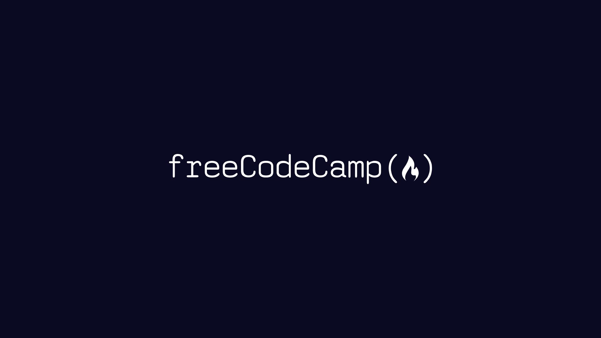

# 📚 freeCodeCamp Soulutions

## 📗 **Introduction**

This repository is my **personal space** for storing and collecting various projects that I've practiced and built while learning through the [**freeCodeCamp**](https://www.freecodecamp.org/learn) platform. Its primary goal is to **track my development**, **showcase my skills**, and **share my unique problem-solving approaches**. Please note, this repository does **NOT** contain *all content* from [freeCodeCamp](https://www.freecodecamp.org/learn).

### 🎯 **Purpose & Goals**
This repository is designed to help me:

* **Track Progress** — *Monitor my development* in **problem-solving** and **technical skills**.
* **Deepen Understanding** — *Enhance my understanding* of **Software-focused Programmer**.
* **Interview Preparation** — *Strengthen my skills* for **technical interviews** and **continuous learning**.
* **Knowledge Sharing** — *Contribute* to the broader **programming community**.

---

## 💡 **How to Explore**

Follow these **simple steps** to navigate through the solutions:

### **Step 1: Select a Category**

Browse the [**Table of Contents**](#-table-of-contents) to find **categories**.

### **Step 2: Choose a Project**

Each entry provides **essential information**:

* **Project Name** — A *direct link* to the project on [**freeCodeCamp**](https://www.freecodecamp.org/learn).
* **Description** — A *brief summary* of what you'll find in that project.
* **Focus Point** — The main *programming languages*, *tools*, or **key concepts** reinforced by the project.
* **Directory Link** — Click "**Open**" to navigate directly to the project's *directory*, which contains the code and related files.

### **Step 3: Explore the Code and Solutions**

Inside each project *directory*, you'll find the **code files** and potentially a **README.md** that provides further details about my **problem-solving approach**.

---
## 📖 **Table of Contents**

This Table of Contents primarily covers the **Coursework**, **Interview Preparation**, **Learn English**, **Professional Certifications** and **Recommended Curriculum** available in this repository, organized by different areas of software development and programming expertise.

### Main Categories

* 📁 **Coursework**
  * 📂 [**Responsive Web Design**](./coursework/responsive-web-design/)
  * 📂 [**JavaScript Algorithms and Data Structures**](./coursework/javaScript-algorithms-and-data-structures/)
* 📁 **Interview Preparation**
* 📁 **Learn English**
* 📁 **Professional Certifications**
* 📁 **Recommended Curriculum**

> **Note:** This repository reflects the specific learning paths and projects I've completed through **[freeCodeCamp](https://www.freecodecamp.org/learn)**. The platform offers many additional courses and certifications beyond what's currently documented here.

---

## 📂 **JavaScript Algorithms and Data Structures**

Below is a comprehensive list of all **JavaScript Algorithms and Data Structures** projects available in this repository, designed to build progressive programming skills from foundational JavaScript syntax to advanced algorithm design and data structure implementation.

| Project Name | Description | Focus Point | Directory |
| :------------------------- | :------------------------------------------------------------------------------------------------------------------------------------------------------------------------------------------- | :---------------------------------- | :---------------------- |
|[**Learn Introductory JavaScript by Building a Pyramid Generator**](https://www.freecodecamp.org/learn/javascript-algorithms-and-data-structures-v8/learn-introductory-javascript-by-building-a-pyramid-generator/step-1) | | | [Open](./coursework/javaScript-algorithms-and-data-structures/learn-introductory-javascript-by-building-a-pyramid-generator/) |
| [**Review JavaScript Fundamentals by Building a Gradebook App**](https://www.freecodecamp.org/learn/javascript-algorithms-and-data-structures-v8/review-js-fundamentals-by-building-a-gradebook-app/step-1) | | | [Open](./coursework/javaScript-algorithms-and-data-structures/review-javascript-fundamentals-by-building-a-gradebook-app/) |

You can [**click here**](./coursework/javaScript-algorithms-and-data-structures/) to see more **JavaScript Algorithms and Data Structures** projects.

---

### 🙏 **Thank You, [freeCodeCamp](https://www.freecodecamp.org/learn)**

I want to express my sincere gratitude to **[freeCodeCamp](https://www.freecodecamp.org/learn)** for their incredible learning resources, high-quality curriculum, and the opportunity to enhance my coding skills. The knowledge and experience gained from **[freeCodeCamp](https://www.freecodecamp.org/learn)** have significantly contributed to creating these projects and developing my abilities.